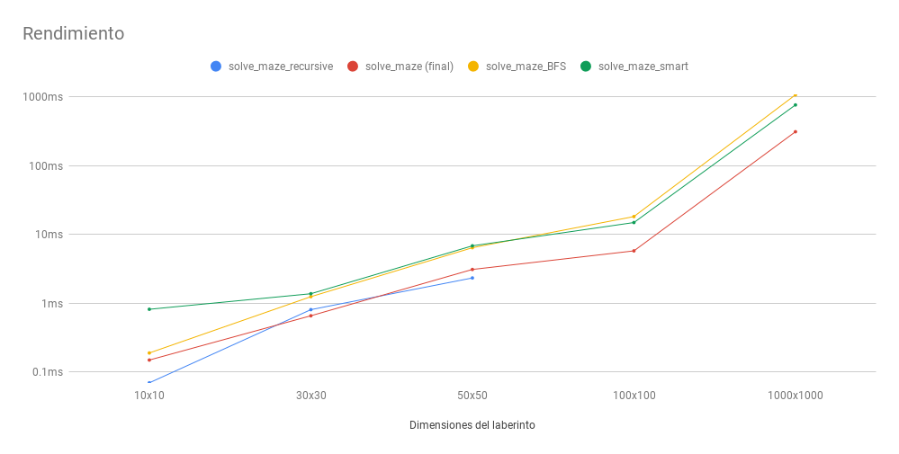

# Maze (Trabajo Práctico Final - Programación 2)
## Juan Cruz de La Torre - (LCC: D-4103/3, LF: D-4104/1)

### generate-maze.c

Modo de uso:
- `./generate-maze [archivo-de-entrada.txt] [archivo-de-salida.txt]`

El archivo de entrada debe tener el siguiente formato:
- La primer línea expresa las dimensiones del laberinto separadas por un espacio (máximo: 15 15)
- La segunda línea expresa las coordenadas del objetivo separadas por un espacio (entre 0 0 y 14 14)
- El resto de las líneas expresan las coordenadas de las paredes separadas un espacio (máximo: 20 líneas)

Por ejemplo: *(archivo-de-entrada.txt)*

> 4 4\
> 0 3\
> 0 1\
> 1 1\
> 2 1\
> 0 2\
> 1 2\
> 2 2

Genera: *(archivo-de-salida.txt)*

> 0112\
> 0110\
> 0110\
> 0000

No es necesario que el archivo de salida exista con anterioridad.

### solve_maze.py

Modo de uso:
- `python solve_maze.py [laberinto.txt]`

El archivo a recibir debe contener un laberinto de la forma:

> 0100010001\
> 0101010101\
> 0101010101\
> 0101010101\
> 0101010101\
> 0101010101\
> 0101010101\
> 0101010101\
> 0101010101\
> 0001000102

Los 0 representan posiciones vacías, los 1 paredes y el 2 representa el objetivo. El laberinto puede tener tantas filas y columnas como se desee.

La función `solve_maze` utiliza un algoritmo similar al de DFS (depth-first search) para hallar una lista de pasos que llevan al objetivo. Funciona de la siguiente manera:

> - Recibe un laberinto (`maze`). *Se representa un laberinto con una `list(list(int))`*
>   - `maze[i][j] == 0` representa una posición vacía.
>   - `maze[i][j] == 1` representa una posición con una pared.
>   - `maze[i][j] == 2` representa el objetivo.
>   - `maze[i][j] == -1` representa una posición que ya ha sido visitada.
>
> - Se inicializa una pila (`stack`) que contiene la esquina superior izquierda del laberinto `(0, 0)` *Se representa una pila con una `list(tuple(int, int))`*
> - Se inicializa una lista de pasos (`steps`) vacía. *Se representa una lista de pasos con una `list(tuple(int, int))`*
> - Mientras que no se ha llegado al objetivo y todavía hay elementos en la pila:
>   - Se retira (`pop`) una tupla de la pila
>   - Si dicha tupla es `(-1, -1)`: quitamos el último elemento de la lista de pasos.
>   - Si no, y si la tupla representa una posición que se encuentra dentro del laberinto:
>     - Si la tupla representa una posición vacía, agregamos la tupla a la lista de pasos: marcamos la posición como visitada, y agregamos a la pila una tupla `(-1, -1)` y los 4 vecinos (`neighbors`) de la posición.
>     - Si no, y si la tupla representa el objetivo: agregamos la tupla a la lista de pasos y se ha llegado al objetivo.
>     - Si no se cumple ninguna de las condiciones anteriores, no se hace nada.
>   - Si no se cumple ninguna de las condiciones anteriores, no se hace nada.
> - Se devuelve la lista de pasos.


**_Nota:_** La tupla `(-1, -1)` que se agrega junto con los vecinos a la pila tiene un uso particular:
> Si se retira de la pila, significa que los 4 vecinos no llevaban al objetivo, ya sea porque representan posiciones con una pared, o ya visitadas, o fuera de las dimensiones del laberinto, o porque continuando el recorrido por ninguno de ellos lleva al objetivo.

De esta manera resulta que la última tupla que agregamos a la lista de pasos representa una posición que no lleva de ninguna forma al objetivo, y por lo tanto lo quitamos de la lista de pasos.

#### Rendimiento en comparación a implementaciones previas a la final

El algoritmo final no fue el mismo que el inicial. En el desarrollo de este Trabajo Práctico, probé algunas variantes del mismo y las comparé usando el decorador `@timeit` definido en `util.py`. Al final de esta sección se presenta una tabla con los tiempos de cada una usando laberintos de dimensiones varias.

##### solve_maze_recursive
Inicialmente, el algoritmo funcionaba muy parecido a la versión final pero era recursivo. Sin embargo lo descarté rápidamente porque para laberintos grandes (por ejemplo con *maze-100x100.txt* y *maze-1000x1000.txt*), llegaba al límite de recursividad establecido por Python.

##### solve_maze (final)
Por eso decidí repensar el algoritmo y eliminar la dependencia en la recursividad. Escribí una nueva versión (que resultó ser la final), y al comparar el rendimiento contra `solve_maze_recursive`, excepto para *maze-10x10.txt* y *maze-50x50.txt*.

##### solve_maze_BFS
Luego, comencé a investigar como mejorar el rendimiento de `solve_maze_dumb`. Así fue como encontré referencias a BFS (breadth-first search) y DFS (depth-first search), noté que mi algoritmo era parecido a un DFS y decidí probar con una implementación de BFS. Tuve que hacer algunas modificaciones para poder construir la lista de pasos, pero el principal cambio era cambiar la pila (`stack`) por una cola (`queue`). Esta versión resultó ser más lenta que `solve_maze`, por lo que también la descarté rapidamente.

##### solve_maze_smart
Por último, noté que mi algoritmo tenía una pequeña desventaja. La prioridad que establecí para el orden en que se recorren los vecinos era ABAJO-DERECHA-ARRIBA-IZQUIERDA. Si el laberinto era algo como:

> 0 0 0 2 0\
> 0 1 1 1 0\
> 0 1 1 1 0\
> 0 1 1 1 0\
> 0 0 0 0 0

El recorrido que encontraba era:

> \+ 0 0 \+ \+\
> \+ 1 1 1 \+\
> \+ 1 1 1 \+\
> \+ 1 1 1 \+\
> \+ \+ \+ \+ \+

Por lo tanto, devolvía:

> [(0, 0), (1, 0), (2, 0), (3, 0), (4, 0), (4, 1), (4, 2), (4, 3), (4, 4), (3, 4), (2, 4), (1, 4), (0, 4), (0, 3)]

Es decir que en vez de tomar el camino obvio y mucho más corto, tomaba uno mucho más largo debido al orden que elegí.

Entonces, probé una pequeña modificación al camino que consistía en ordenar a los vecinos según la distancia al objetivo. De esta manera, el algoritmo intentaba primero con aquellos vecinos "más cercanos" al objetivo y luego con los "más lejanos".

```python
def sorted_neighbors(row, col, goal_position):
    def distance_to_goal(position):
        return sqrt((position[0] - goal_position[0])**2 +
                    (position[1] - goal_position[1])**2)

    return sorted(neighbors(row, col), key=distance_to_goal, reverse=True)
```

Luego de esa modificación, el recorrido que encontraba era:

> \+ \+ \+ \+ 0\
> 0 1 1 1 0\
> 0 1 1 1 0\
> 0 1 1 1 0\
> 0 0 0 0 0

Y devolvía:

> [(0, 0), (0, 1), (0, 2), (0, 3)]

Sin embargo, debido a que esta versión corría más lento (excepto en algunos casos excepcionales como el mencionado), a que el enunciado del TP nunca mencionaba la tarea de encontrar el camino más corto y a que, de todas formas, esta modificación no aseguraba que se iba a tomar el camino más corto, decidí no incluir esta modificación en la versión final.

A continuación se presenta una tabla con las estadísticas de rendimiento de cada implementación. Se corrió cada implementación 100 veces en cada laberinto y se calculó el tiempo de ejecución promedio.

| Implementación           | maze-10x10.txt | maze-30x30.txt | maze-50x50.txt | maze-100x100.txt | maze-1000x1000.txt |
| ------------------------ |:-------------: |:--------------:|:--------------:|:----------------:|:------------------:|
| **solve_maze_recursive** | **0.07 ms**    | 0.81 ms        | **2.34 ms**    | -                | -                  |
| **solve_maze** (*final*) | 0.15 ms        | **0.66 ms**    | 3.11 ms        | **5.79 ms**      | **312.18 ms**      |
| **solve_maze_BFS**       | 0.19 ms        | 1.25 ms        | 6.44 ms        | 18.26 ms         | 1073.89 ms         |
| **solve_maze_smart**     | 0.82 ms        | 1.38 ms        | 6.86 ms        | 14.95 ms         | 765.63 ms          |


